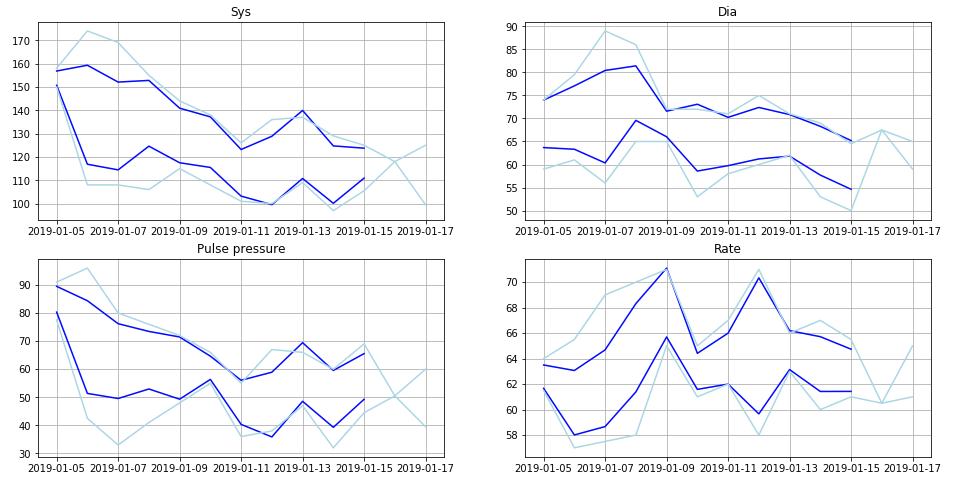
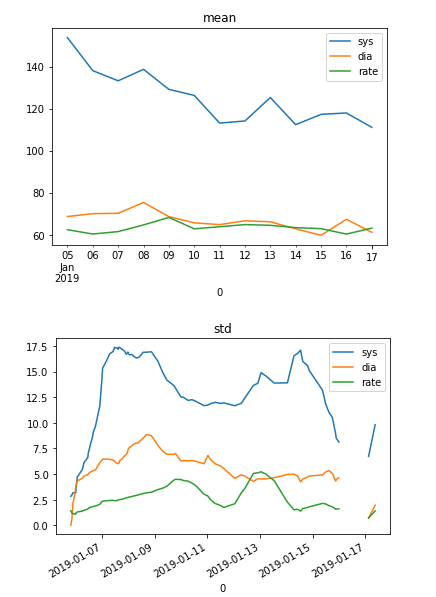
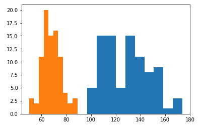

Introduction
------------
The notebook is aimed to help people who (or whoes relatives) have problems with their blood pressure level. My grandma is in her 80s and doctors can't prescribe the exact pills, because they need to try different solutions. You can see the results of the file [here](blood-pressure-insights.ipynb).

So, the input data looks like:
```python
[ "2019-01-05 19:00", 152, 	69, 62 ],
[ "2019-01-05 19:50", 156, 	69, 64 ],
[ "2019-01-05 20:43", 158, 	71, 63 ],
```

and the visualization looks, for instance, this way:





Installation
------------
### 1.  Install `Python` 
If you haven't done it yet. It works well with both `Python 2` and `Python 3`. There's [a good manual](https://wiki.python.org/moin/BeginnersGuide/Download) for newcomers.

### 2. Install dependencies
python3:
```bash
sudo python3 -m pip install scipy
sudo python3 -m pip install pandas
sudo python3 -m pip install matplotlib
```
For Python 2 use just `sudo python -m pip ...` or `sudo python2 -m pip...`.

### 3. [Install Jupyter Notebook](https://jupyter.org/install)
```bash
sudo python3 -m pip install jupyter
```


Running
-------
1. Download [the file](blood-pressure-insights.ipynb).
2. In terminal, withing the directory with the file, type: `jupyter-notebook`.
3. The browser will be opened automatically, in the window, choose the file `blood-pressure-insights.ipynb`.
4. You're all set! Now you can work with your local copy of the file, fulfill it with your own data and so on! :)


Contribution
------------
- All your ideas, please, feel free to write to [this thread](https://github.com/egslava/blood-pressure-insights/issues/1). The separated thread is created especially to notify all the creative users about each other. 
- For bugs/questions/support/gotchas, please, file a [new issue](https://github.com/egslava/blood-pressure-insights/issues/new).
- Pullrequests, if you have any, are welcome as well. Both redesigns/code matter for sure.
- if you know people interested in the same problem (or you are)- it would be nice to connect us :)

Similar projects and people
---------------------------
1. @mr-ubik created the [grandpyrents](https://github.com/mr-ubik/grandpyrents) does an amazing job. He imports data from Google Docs so it will be easy to collect the data if you're living apart of the patient and want just to ask your neighbours to fill the docs sometimes.
2. @ishanrai05 did the [Blood_Pressure_Analysis](https://github.com/ishanrai05/Blood_Pressure_Analysis/blob/master/Blood_Pressure_Analysis.ipynb) where he plots the pressure in a really nice way in R. Though, it seems, the plot looks a bit too smooth, kind of 'underlearnt'.
3. @berlogabob [also tried](https://github.com/berlogabob/blood_pressure/blob/master/main.ipynb) and seemed to be interested.

